<div align="center">

# Hi there, I'm Harsh Upadhyay! 👋


</div>

## 🚀 About Me

> **Passionate developer exploring web applications, automation, and AI-driven solutions.**

- 🎬 Currently building **[Cinevood](https://cinenvood.onrender.com/)** – a comprehensive movie review platform with admin management.
- 🌦️ Also created **[Weather App](https://weather-j82w.onrender.com/)** – a real-time weather tracking application.
- 🤖 Automating tasks with **[@TIMEPASSQ_BOT](https://t.me/TIMEPASSQ_BOT)** – my personal Telegram bot for media and task management.

<br>

<div align="center">

<h3><code>harsh@github ~ $ ./contributions.sh</code></h3>


<br><br>

<h3><code>harsh@github ~ $ whoami</code></h3>
<table>
  <tr>
    <td valign="top"></td>
    <td valign="top"></td>
  </tr>
</table>

</div>

<br>

<div align="center">

`Every graphic above is a self-contained animated SVG — no third-party stats service, no token, no JavaScript. The heatmap re-scrapes and re-renders itself daily via GitHub Actions.`

</div>

<br>

<details>
<summary>🛠️ How this stays up to date</summary>

<br>

- `contrib-heatmap.svg` is regenerated every day at ~06:17 UTC by `.github/workflows/update-profile-art.yml`, which runs `scripts/fetch_contributions.py` (scrapes the public `github.com/users/<you>/contributions` page, no PAT needed) and `scripts/render_heatmap_svg.py`, then commits the result.
- `dh-ascii.svg` and `info-card.svg` are static — regenerate them locally only when your photo or bio changes:
  ```
  pip install -r scripts/requirements.txt
  python scripts/make_ascii_svg.py
  python scripts/make_info_card.py
  ```
- To swap the placeholder ASCII banner for a real photo-derived portrait, see the pipeline documented in `scripts/prep_photo.py`.
- Trigger the workflow once by hand from the **Actions** tab (`workflow_dispatch`) to confirm it commits a fresh heatmap.

</details>
