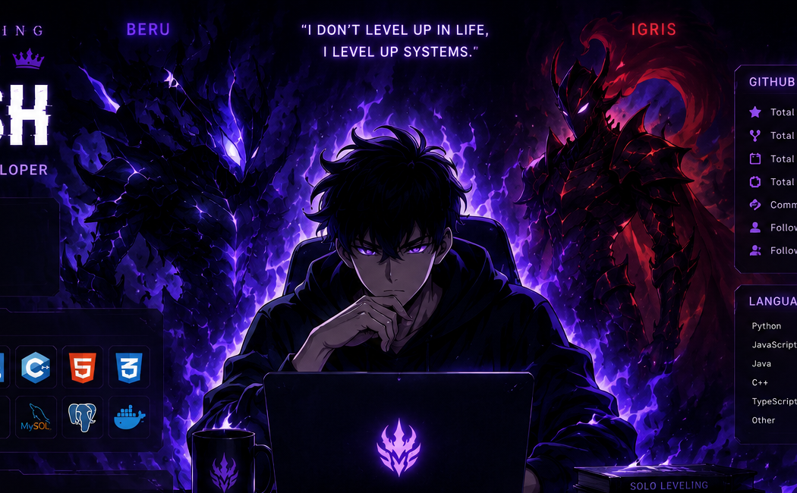

<div align="center">



> **“Code is like humor. When you have to explain it, it’s bad.”**

</div>

# `Dev-Harshupadhyay@github ~ $ ./about.sh`

Passionate BCA student exploring web development, backend systems, automation, and AI-powered applications. I like understanding how things work under the hood before I try to make them better — and I learn fastest by building, breaking, and rebuilding.

- 🎬 Building **Cinewood** — a movie review platform with admin management.
- 🌦️ Built **Weather App** — a real-time weather tracking application.
- 🤖 Automating everyday tasks with a personal Telegram bot for media and task management.
- 🌱 Currently deepening my understanding of backend architecture and AI-assisted automation.

---

# `Dev-Harshupadhyay@github ~ $ ./projects.sh`

| Project | Description | Stack |
|---|---|---|
| **Cinewood** | Movie review platform with admin management. | `HTML` `CSS` `JavaScript` |
| **Weather App** | Real-time weather tracking application. | `HTML` `CSS` `JavaScript` |

> ▸ More repositories — smaller builds, practice projects and experiments.

---

# `Dev-Harshupadhyay@github ~ $ ./stack.sh`

### Technologies I work with

<p>
  
  
  
  
  
  
</p>

### Currently exploring

`Backend Architecture` · `APIs` · `Automation` · `AI Applications` · `System Design`

---

# `Dev-Harshupadhyay@github ~ $ ./stats.sh`

<div align="center">


<br>


</div>

---

# `Dev-Harshupadhyay@github ~ $ ./terminal.sh`

```text
┌──────────────────────────────────────────────────────────────┐
│  harsh@github:~$ whoami                                      │
│                                                              │
│  BCA Student • Developer • Builder                           │
│                                                              │
│  harsh@github:~$ focus                                       │
│                                                              │
│  Web Development                                             │
│  Backend Systems                                              │
│  Automation                                                   │
│  AI-Powered Applications                                     │
│                                                              │
│  harsh@github:~$ status                                      │
│                                                              │
│  Building → Learning → Breaking → Rebuilding                 │
└──────────────────────────────────────────────────────────────┘
