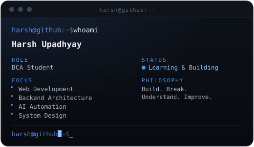

<i>“Code is like humor. When you have to explain it, it’s bad.”</i>

 

## `Dev-Harshupadhyay@github ~ $ ./about.sh`

Passionate BCA student exploring web development, backend systems, automation, and AI-powered applications. I like understanding how things work under the hood before I try to make them better — and I learn fastest by building, breaking, and rebuilding.

- 🎬 Building **[Cinevood](https://cinenvood.onrender.com/)** — a movie review platform with admin management.
- 🌦️ Built **[Weather App](https://weather-j82w.onrender.com/)** — a real-time weather tracking application.
- 🤖 Automating everyday tasks with a personal Telegram bot for media and task management.
- 🌱 Currently deepening my understanding of backend architecture and AI-assisted automation.

 

## `Dev-Harshupadhyay@github ~ $ ./projects.sh`

<table>
<tr>
<td width="50%" valign="top">

**[Cinevood](https://cinenvood.onrender.com/)**

Movie review platform with admin management.

`HTML` `CSS` `JavaScript`

</td>

<td width="50%" valign="top">

**[Weather App](https://weather-j82w.onrender.com/)**

Real-time weather tracking application.

`HTML` `CSS` `JavaScript`

</td>
</tr>
</table>

<b>More repositories</b> — smaller builds, practice projects and experiments

 

| Repository | Language | Notes |
|---|---|---|
| [Harsh-Multi-tools-](https://github.com/Dev-Harshupadhyay/Harsh-Multi-tools-) | HTML | A collection of small web-based utility tools |
| [pro.html](https://github.com/Dev-Harshupadhyay/pro.html) | HTML | Personal "about me" page experiment |
| [script.js](https://github.com/Dev-Harshupadhyay/script.js) | JavaScript | Standalone JavaScript exploration |
| [app.py](https://github.com/Dev-Harshupadhyay/app.py) | Python | Python application / backend practice |
| [Happy-birthday-](https://github.com/Dev-Harshupadhyay/Happy-birthday-) | HTML | Interactive front-end mini-project |
| [Piyush](https://github.com/Dev-Harshupadhyay/Piyush) | HTML | Front-end practice repository |

See the full list on the [repositories tab](https://github.com/Dev-Harshupadhyay?tab=repositories).

 

## `Dev-Harshupadhyay@github ~ $ ./stack.sh`

**Technologies I work with**

**Technologies I'm exploring**

 

 
