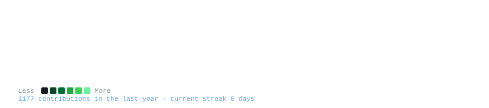
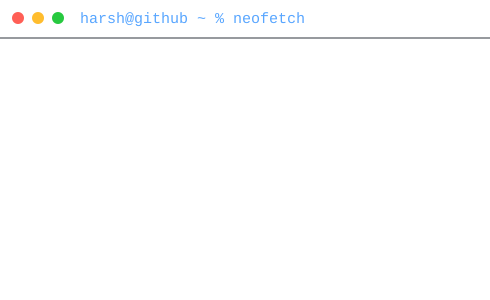

<div align="center">

# Hi there, I'm Harsh Upadhyay! 👋


<sub>Building things on the web, one commit at a time.</sub>

</div>

<br>

## 👋 About Me

I'm **Harsh Upadhyay** — a BCA student and full-stack developer from India. I made this GitHub account in **January 2025**, and it's been my workshop ever since: **38 public repositories** and **1,076 contributions** in 2026 alone.

I'm not the kind of developer who collects finished tutorials. I like building things that actually open in a browser and do something — a movie site someone can browse, a weather app someone can check before leaving the house, a Telegram bot that quietly automates a boring job. If it runs at a public URL and a real person can use it, I'm interested.

Most of what I know, I learned by breaking things and then having to fix them. That's still how I work: build it badly, understand why it's bad, rebuild it properly.

> ### 💭 "Code is like humor. When you have to explain it, it's bad."

<br>

## 🚀 What I'm Building

| Project | What it is | Live |
|:---|:---|:---:|
| **Chhath Geet** | A devotional music platform for Chhath Puja — 106 verified folk songs, a real player with queue, repeat and lock-screen controls, 37 artists and 12 curated playlists. Built with Vite + React. | [Repo](https://github.com/Dev-Harshupadhyay/Chhath-puja) |
| **Cinevood** | A movie review platform with a full admin panel — browse, review and manage film data end to end. | [cinenvood.onrender.com](https://cinenvood.onrender.com) |
| **Weather App** | Real-time weather tracking with a clean, fast interface. | [weather-j82w.onrender.com](https://weather-j82w.onrender.com) |
| **@TIMEPASSQ_BOT** | My personal Telegram bot for media handling and task automation. | [@TIMEPASSQ_BOT](https://t.me/TIMEPASSQ_BOT) |

<br>

## 🛠️ My Stack

<div align="center">

**Frontend** — React · Next.js · JavaScript · TypeScript · HTML5 · CSS3

**Backend** — Node.js · Express · Python

**Data** — MongoDB · SQL

**Shipping** — Git & GitHub Actions · Render · Netlify · Vercel

<br>


</div>

<br>

## 📊 2026, By The Numbers

<div align="center">

| 🔥 Contributions | 📦 Public Repos | 📅 Active Days | ⚡ Longest Streak | 🏆 Best Day |
|:---:|:---:|:---:|:---:|:---:|
| **1,076** | **38** | **64** | **8 days** | **141 commits** |

<sub>Real counts pulled from my public contribution calendar — not a third-party stats service.</sub>

</div>

<br>

## 📈 Where The Work Actually Happened

<div align="center">

<h3><code>harsh@github ~ $ ./contributions.sh</code></h3>


<br><br>

<h3><code>harsh@github ~ $ whoami</code></h3>
<table>
  <tr>
    <td valign="top"></td>
    <td valign="top"></td>
  </tr>
</table>

<br><br>

<h3><code>harsh@github ~ $ ./connect.sh</code></h3>

<a href="https://pmharshuu.netlify.app"></a>
<a href="https://github.com/Dev-Harshupadhyay/Chhath-puja"></a>
<a href="https://t.me/TIMEPASSQ_BOT"></a>

</div>

<br>

## 🌱 Right Now

- 🎵 **Shipping Chhath Geet** — growing it from a small song list into a proper platform: full player, 106 songs, playlists, keyboard and lock-screen controls.
- ⚛️ **Getting deeper into Next.js and TypeScript** — my three most recent builds are all TypeScript.
- 🤖 **Automating more of my own workflow** — bots and scripts so the boring stuff runs itself.
- 📚 **Finishing my BCA** while keeping the build streak alive.

<br>

## 📫 Let's Connect

I'm always up for talking about web development, automation, or a project that's slightly too ambitious. Open an issue, drop a star, or just say hi.

<div align="center">

`Every graphic in this profile is a self-contained animated SVG — no third-party stats service, no token, no JavaScript. The heatmap re-fetches and re-renders itself daily via GitHub Actions.`

</div>

<br>

<details>
<summary>🛠️ How this stays up to date</summary>

<br>

- `contrib-heatmap.svg` is regenerated every day at ~06:17 UTC by `.github/workflows/update-profile-art.yml`. The workflow runs `scripts/fetch_contributions.py`, which reads the public contribution calendar (GitHub's own `/contributions` fragment is now rendered client-side, so it scrapes nothing — it uses a public mirror of the same data, no PAT required), then `scripts/render_heatmap_svg.py`, then commits the result.
- `dh-ascii.svg` and `info-card.svg` are static — regenerate them locally only when your photo or bio changes:
  ```
  pip install -r scripts/requirements.txt
  python scripts/make_ascii_svg.py
  python scripts/make_info_card.py
  ```
- To swap the placeholder ASCII banner for a real photo-derived portrait, see the pipeline documented in `scripts/prep_photo.py`.
- Trigger the workflow by hand from the **Actions** tab (`workflow_dispatch`) to confirm it commits a fresh heatmap.

</details>

<br>

<div align="center">

⭐️ **If you found this profile setup cool, feel free to star the repo!**

<br>

**Thanks for visiting — let's build something amazing together.** 🚀

</div>
